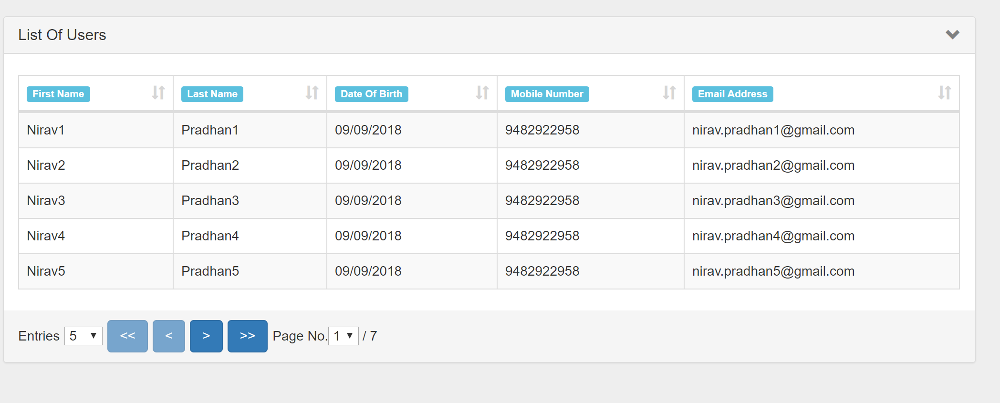

# JSF Pagination Component
This Pagination componenet can be used with any jsf component library datatable provided 
the built in pagination needs to be disabled for those datatables. Its designed using jsf com
 composite component, offers alternative to pagination. It can be used with html 
table generated with <ui:repeat>. It supports Next Page, Previous Page, First Page, Last Page
Entries per page, Going to specific page in table view.



## Software configuration used in project
javaee-web-api-8.0, myfaces-api-2.3.1, myfaces-impl, primeface-2.3.1s-6.2, 
bootsfaces-1.3.1, java-10, tested on tomcat 9

It can be customized to use different jsf components to build pagination composite 
component by removing bootfaces, primefaces components and using only jsf specific components.

### Usage
The pagination can be implemented by extending <link>me.niravpradhan.jsf.utils.AbstractPaginationBean<E></link>
This class has three abstract methods that sub class needs to implement.
* void setList(List<E> list) - sets the list in bean;
* List<E> getList() - gets the list from bean, used in jsf view;
* List<E> getSubList(int startIndex, int endIndex) - This method gets sublist from Business
  Object based on startIndex and endIndex

* The implementing sub-class should be in ViewScoped to maintain pagination related
variables state. 

* The implementing class needs to provide @PostConstruct method init as below to setup
initial pagination variables and list. E.g.
    ```
    @PostConstruct
    public void init() {
        // set total no of rows in table
        setCount(Repository.count());
        // set no of rows per page
        setNoOfRows(5);
        // set the start Index
        setStartIndex(0);
        // set the end index
        setEndIndex(getNoOfRows());

        // set the no of pages in table
        calculatePages();

        // get the list based on startIndex and endIndex
        list = getSubList(getStartIndex(), getEndIndex());
    }
    ```
    
* The following namespace should be added in jsf view to use component.
  ```aidl
  xmlns:utils="http://xmlns.jcp.org/jsf/composite/utils"
  ```   
  
* The component can be added in following way in jsf view.
  ```aidl
  <utils:pagination bean="#{usersBean}" updateIds="myform:mytablepanel" entriesNos="1,5,10,15,20"
                         firstLabel="#{labels.FIRST}" previousLabel="#{labels.PREVIOUS}"
                         nextLabel="#{labels.NEXT}" lastLabel="#{labels.LAST}"/>
  ``` 
  1. bean attribute value is used to specify pagination bean which extends AbstractPaginationBean.
  2. updateIds attribute value should be parent component id which contains both table and pagination
     component.
  3. entriesNo attribute value should be comma seperated values for entries per page.
  4. The other firstLabel, previousLabel, nextLabel, lastLabel, showEntriesLabel,
     pageNoLabel are optional used to configure pagination sub components labels.
     The default values are taken from /META-INF/resources/utils/pagination.properties.
  5. The resource bundle can be created for other languages to support I18N in pagination
     component project or in consuming project.
     
* The full example code is available in /src/main/java/me/niravpradhan/jsf/examples directory.
  


